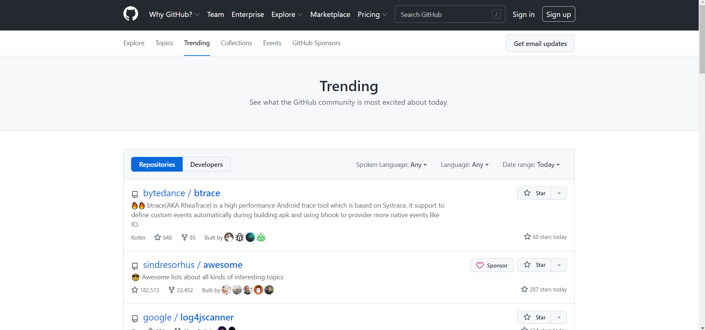
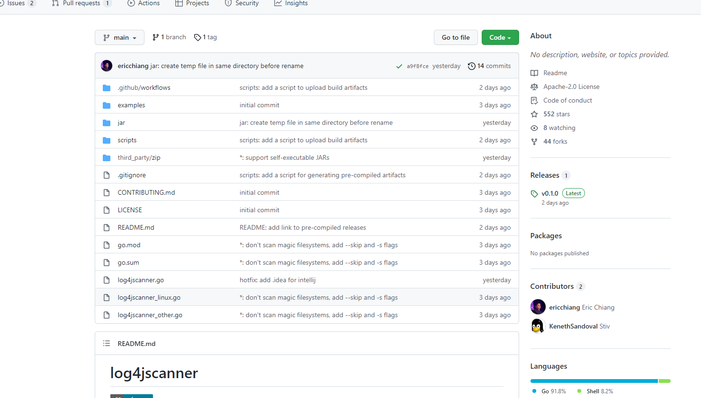
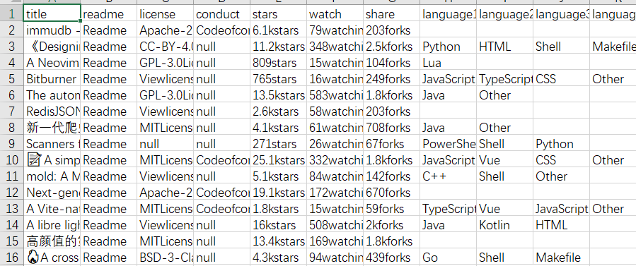
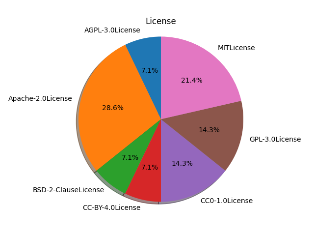
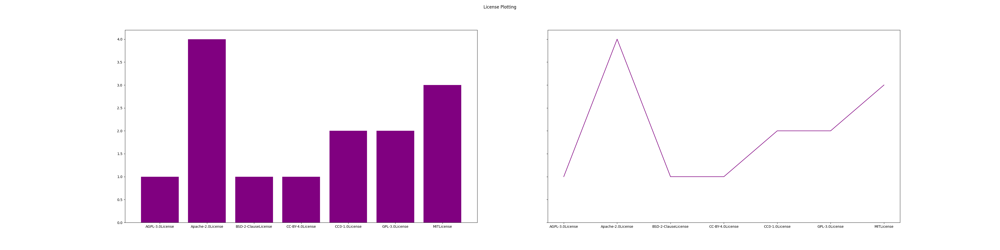
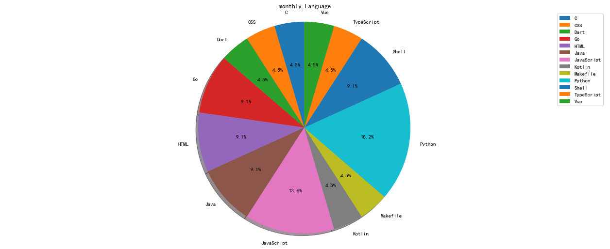
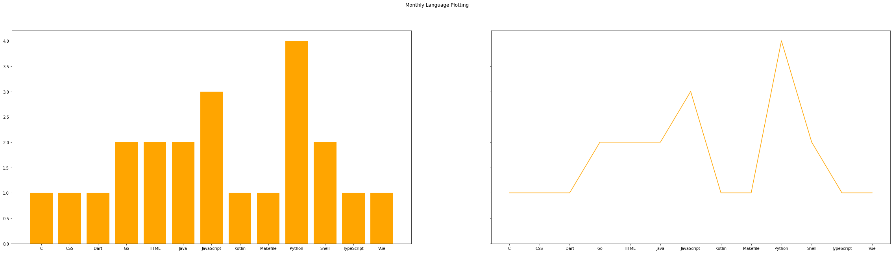
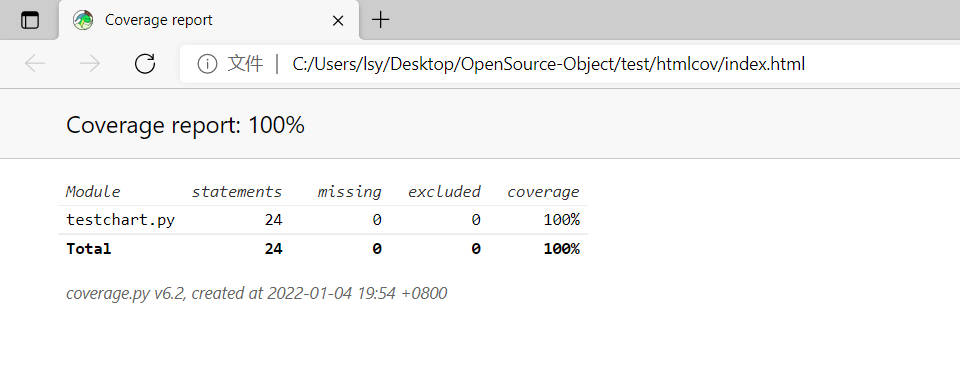

# 这是一份主要爬取并分析Github上的Trending榜上项目所使用的开源许可证与主要编程语言分析的大作业

## 一、小组成员

林双印、聂文轩、姬宇航、金昊源、王越

## 二、主要内容

* 明确选题：参考课上老师所讲授的内容，最终选择了分析开源仓库Github上的Trending日榜、周榜、月榜上的项目所采用的开源许可证种类及其项目所采用的编程语言。

* 实际操作：克服校园网不稳定的问题，爬取了GitHub在2020年12月28日的Trending榜内的每个具体项目的许可证、编程语言、热门指数等诸多信息。

  图一：趋势榜

  

  ​                                                                                                   

  图2：趋势榜内具体项目的信息提取（许可证、编程语言等信息）

  

  ​                                                                   

   图3：最终爬取到的数据（部分）

  

  ​                                                                                        

* 数去清洗、处理：对爬取下的数据利用numpy，pandas等开源的库进行数据提取到动态数组array，并存入DataFrame,并清洗掉空格，ViewLicense及Other等脏数据。

* 数据可视化：利用matplotlib对数据进行可视化，尝试分析结论。因为图太多了，下面只展示部分图片：

  > 日榜许可证使用情况
  >
  > > 
  > >
  > > 
  >
  > 月榜语言使用情况
  >
  > > 
  > >
  > > 
  >

* 之后，我们还对编写出来的程序进行了单元测试，主要利用了unittest库及coverage库，用例对程序覆盖率高达100%

  

  

## 三、结论

​      通过上面的努力，我们发现最终在开源项目中许可证大多还是以Apache2.0及MIT系列为主，相对比较宽松，是可以直接使用了“程序轮子”。在语言方面，python和Javascript还是目前比较热门的语言，也基本会遵循每月发布的编程语言排行榜。

